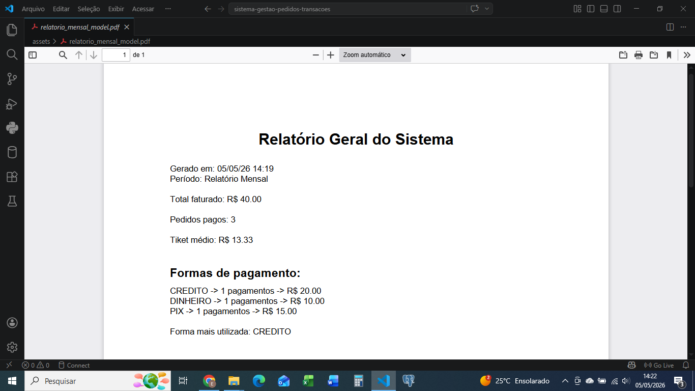
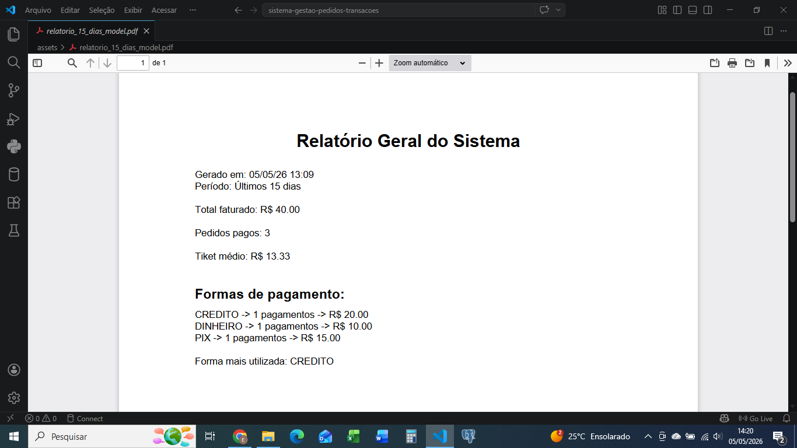

# Sistema de Gestão de Pedidos e Transações

Sistema desenvolvido para gerenciamento de pedidos, clientes, produtos e pagamentos, com geração de relatórios financeiros em PDF.

---

## Funcionalidades

* Cadastro e listagem de produtos
* Cadastro e listagem de clientes
* Criação e gerenciamento de pedidos
* Controle de usuários (ADMIN, FUNCIONÁRIO e CLIENTE)
* Processamento de pagamentos:

  * Dinheiro
  * PIX
  * Cartão de crédito
  * Cartão de débito
* Geração de relatório financeiro em PDF contendo:

  * Total faturado
  * Quantidade de pedidos pagos
  * Ticket médio
  * Distribuição por forma de pagamento

---

## Regras de Negócio

* Clientes visualizam apenas seus próprios pedidos
* Administradores e funcionários visualizam todos os pedidos
* Apenas pedidos com status "PENDENTE" podem ser pagos
* Validação do valor recebido para pagamentos em dinheiro

---

## Tecnologias Utilizadas

* Python
* PostgreSQL
* SQL
* ReportLab

---

## Estrutura do Projeto

```
assets/     # Arquivos gerados (relatórios e imagens)
database/   # Scripts SQL
src/        # Código-fonte da aplicação
```

---

## Exemplo de Relatório

### Relatório Mensal


### Relatório Últimos 15 dias


---

## Como Executar

1. Clonar o repositório:

```
git clone https://github.com/EmersonPereir4/sistema-gestao-pedidos-transacoes.git
```

2. Acessar a pasta do projeto:

```
cd sistema-gestao-pedidos-transacoes
```

3. Configurar o banco de dados PostgreSQL

4. Executar o sistema:

```
python main.py
```

---

## Melhorias Futuras

* Interface web
* API REST
* Dashboard com gráficos
* Autenticação avançada

---

## Autor

Emerson Pereira